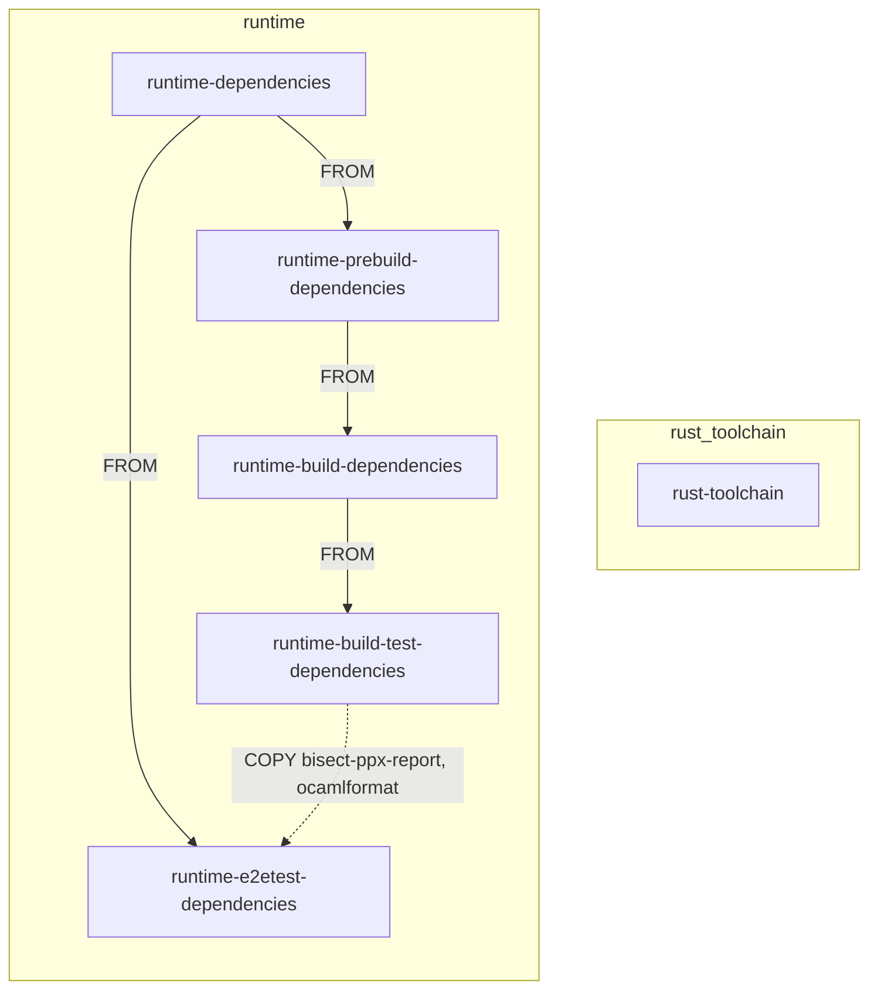

# Octez base Docker images

This repository contains different Docker images and artefacts used in
[Octez](https://gitlab.com/tezos/tezos) CI jobs:

- `packages/` contains specific OPAM packages
- `zcash-params/` contains the Sapling parameters
- `scripts/` contains miscellaneous scripts

## Dockerfiles

The images defined in this repo are used in the CI pipelines of
[Octez](https://gitlab.com/tezos/tezos), and as base images for the
[Octez Docker distribution](https://hub.docker.com/r/tezos/tezos).

They are split in two families: `runtime` and `rust-toolchain`.

In the `runtime` family, all images except `runtime-e2etest-dependencies`, are built on top of each
other, such that the contents of image N is also in N+1[^1]. The image
`runtime-e2etest-dependencies` is built on top of
`runtime-dependencies` and additionally copies some binaries from
`runtime-build-dependencies`:

The `rust-toolchain` family contains only one `rust-toolchain`
image. It is used in the CI of [tezos/tezos](https://gitlab.com/tezos/tezos)
to build and test kernels, and to build the kernel SDK. It is also used to
build the `evm_kernel` distributed in Octez docker distribution.

The images, their content and indented usage, are:

| Image                             | Contents                           | Usage                             |
|-----------------------------------|------------------------------------|-----------------------------------|
| `runtime-dependencies`            | run-time libraries + zcash-params  | distributing Octez executables    |
| `runtime-prebuild-dependencies`   | OCaml + opam package cache + Cargo | CI: OPAM installability tests     |
| `runtime-build-dependencies`      | opam packages                      | CI: Building Octez                |
| `runtime-build-test-dependencies` | Python + NVM + ShellCheck          | CI: Octez tests and documentation |
| `runtime-e2etest-dependencies`    | `eth-cli`                          | CI: Octez integration tests       |
| `rust-toolchain`                  | cargo                              | CI: kernel build, test and SDK    |

For more details on the contents and usage of each image, see the
header comment of each corresponding Dockerfile.

## Adding OPAM dependencies

The images built in this repository are used to in the CI of
[tezos/tezos](https://gitlab.com/tezos/tezos). To update the
dependencies for `tezos/tezos`, this repo has to be modified. For an
in-depth guide, see the Tezos technical documentation's guide on [how
to add or update opam
dependencies](https://tezos.gitlab.io/developer/contributing-adding-a-new-opam-dependency.html).

## Poetry files

`poetry.lock` and `pyproject.toml` defines the Python environment used
to build the Octez documentation. This environment is installed in the
image `runtime-build-test-dependencies` and used in the Octez CI to
build documentation. These files must be kept identical to the ones provided
in the Octez repository: modify them in both repositories at once.

[^1]: There are exceptions. For instance, the
    `runtime-prebuild-dependencies` image contains the sources of the
    OPAM packages from `packages/`, which are used in the `opam` tests
    of `tezos/tezos`. However, they serve no use and are not present
    in the images that build on top of it
    (`runtime-build-dependencies` etc).
